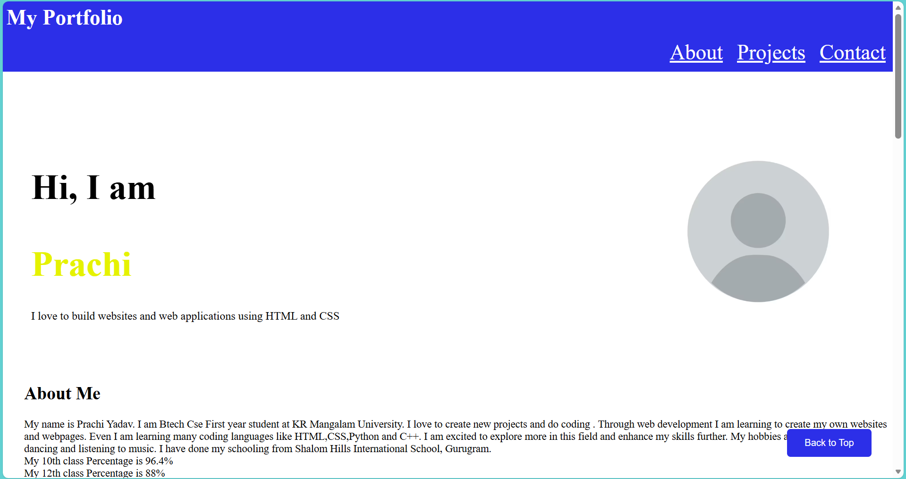
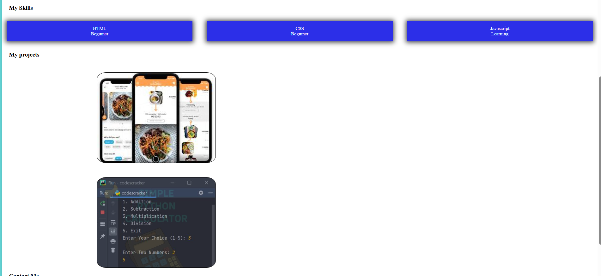

# Portfolio website
Prachi Yadav
# Project description 
A personal website created using HTML and advanced CSS. It consists of use of styling techniques like keyframe animations , flex and many others
It consists of many sections like About section, My Projects section, My skills section and Contact me Section.
# Installation & Usage
1. Clone the repository
git clone[https://github.com/Prachi551/portfolio_website-Prachi-Yadav-2501010119]
2. In order to run it we can directly open the index.html file on our web browser
and even we can see the output using live server also
# Screenshots of Output 




## 📁 Repository Structure

```
Portfolio-Webpage/
│
├── .gitignore
├── index.html
├── style.css
│
├── images/
│   ├── image.png
│   ├── image-1.png
│   ├── image-2.png
│   ├── calorie.png
│   ├── calorie2.jpg
│   ├── calorie3.jpg
│   ├── pic.jpg
│   ├── pic1.jpg
│   ├── pic2.jpg
│   └── pic3.jpg
│
├── README.md
│
└── docs/
    ├── overview.md
    └── development-process.md
```


